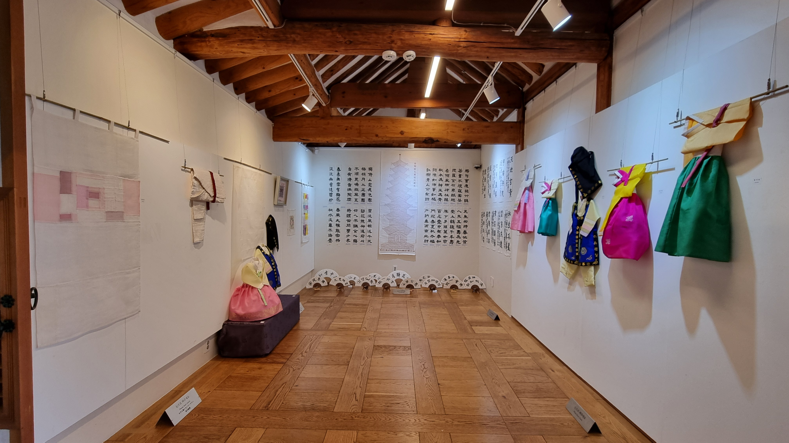
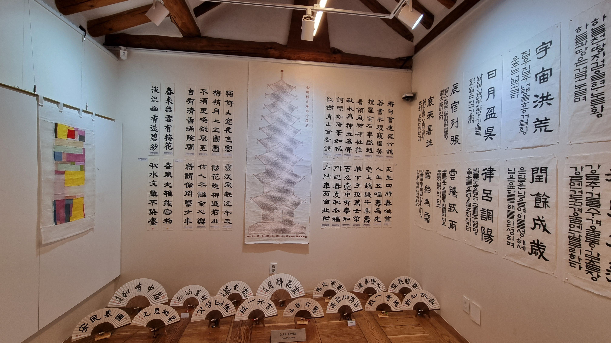
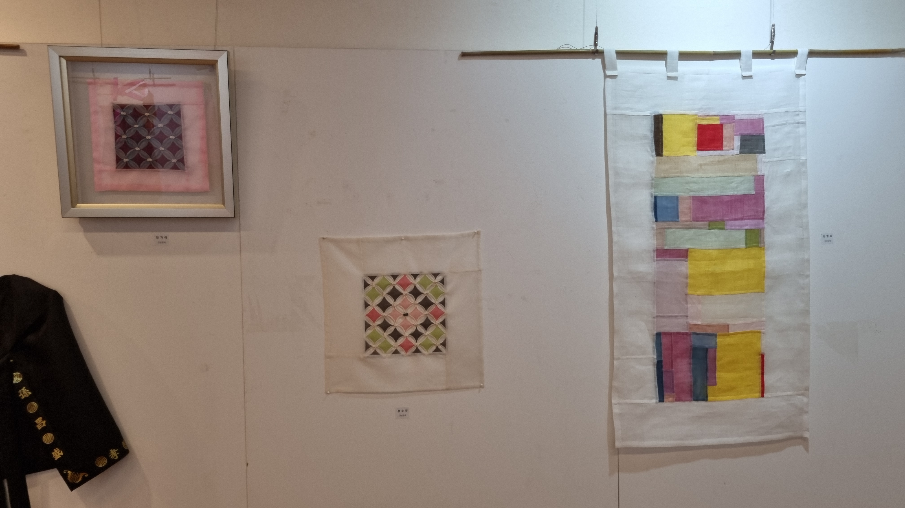
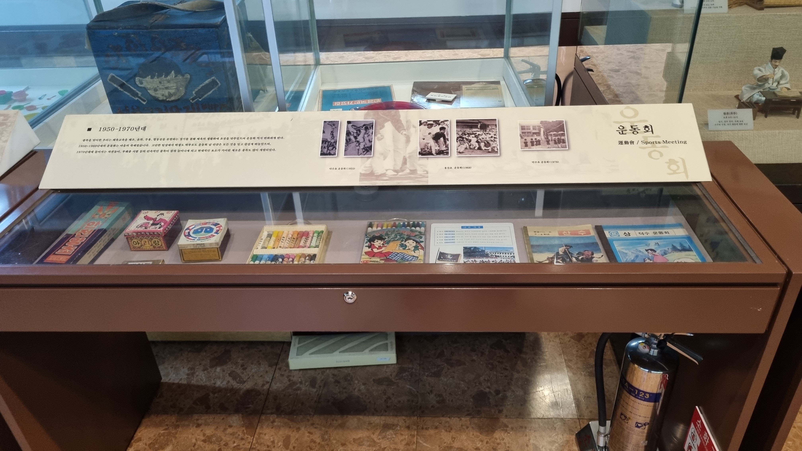

# 어느 오후의 북촌 관광

## A. 문서 이력
- 에세이 작성일 : 2025-09-19
- 최종 수정일 : 2025-12-11

- 작성 툴 : MS Excel
- 에세이 순서 : 23번째 에세이

## B. 본문
  2025년 9월 16일 화요일에 북촌을 방문하였다. 그리고 용무를 마치고 남은 2시간 동안 북촌 한옥마을을 관광하였다. 북촌은 동쪽으로 창덕궁, 서쪽으로 경복궁을 사이에 두고 있다. 이름의 유래는 조선시대 한양의 중심인 청계천과 종로의 윗동네라는 의미라고 한다. 비슷한 명칭을 가진 지역으로 경복궁 서쪽에 위치한 서촌 한옥마을이 있다.

  북촌 한옥마을은 조선시대 때부터 왕족, 양반, 관료가 살던 부촌이었다고 한다. 일제강점기에도 조선인들을 위한 공간으로 계속 남았고 개량 한옥도 등장하였다. 반면 서촌은 일제강점기를 거치며 총독부 관사, 친일 세력가의 저택이 들어서며 다양한 양식의 주택이 생겼다고 한다.

  이러한 역사가 있기 때문인지, 북촌은 도심의 한옥마을 관광지로 인기가 많다. 너무 인기가 많았는지, 북촌로11길은 2025년 3월부터 본격적으로 오후 5시부터 관광객 방문이 제한되고 사진을 촬영할 수 없는 조처를 했다고 한다. 다행히 내가 방문했을 때는 아직 오후 5시가 되기 이전이었다. 덕분에 관광에 큰 제한은 없었다.

  이날 방문한 장소는 가회동의 북촌로12길과 이 길 내부에 있는 가회동 자치회관 전시회, 북촌박물관, 서울교육박물관, 이렇게 네 군데였다. 명인박물관도 방문하였지만, 개관일이 아니어서 바로 나와야 했다. 모두 특색있는 전시를 하고 있기에 인상이 깊었다. 그리고 이 중 가장 인상 깊었던 장소는 의외일지도 모르지만 북촌로12길에 있는 가회동 자치회관 전시회였다.

  이 전시회에선 가회동 주민들이 직접 만든 한복, 보자기 자수, 서예, 동네 풍경 그림 등이 전시되었다. 자치회의 작품을 전시한 것이니만큼, 판매용 예술품이 아니라 생활 예술품으로 보이는데, 판매해도 손색이 없을 만큼 아름다워 보였다. 그리고 보통 주민 자치회의 활동에 서예, 동양화 등 전통문화가 포함되기는 하지만, 이렇게 전통문화가 중심이 되는 경우는 보지 못한 것 같다. 그래서 이 전시에선 이 마을의 오랜 역사와 품격, 그리고 여유가 동시에 느껴졌다.

  가장 마지막에 방문한 장소는 서울교육박물관이었다. 이 박물관은 서울특별시교육청에서 운영하는 무료 박물관으로, 교육과 관련된 여러 시대별 유물이 전시되었다. 이 중 지구의 공전이 그려진 개화기 '중등만국지지', 언더우드 등 서양의 선교사를 중심으로 하여 한반도를 소개한 여러 외국어 서적이 눈에 띄었다. 그리고 1970년대 운동회 상품으로 준비된 것 같은 '알프스의 소녀 하이디' 애니메이션 공책도 눈에 띄었다.

  이 공책이 눈에 띈 이유는 1970년대에도 미야자키 하야오, 타카하타 이사오의 작품이 한반도에서 인기가 있었다는 것을 간접적으로 나타내기 때문이다. 물론 당시 한국인들은 '알프스의 소녀 하이디', '엄마찾아 삼만리', '빨간머리 앤' 등의 <세계명작극장>이나 '미래소년 코난' 등이 일본에서 제작되었고, 미야자키 하야오나 타카하타 이사오가 이러한 작품에서 크게 활약했다는 것을 알지는 못했을 것이다. 하지만, 미야자키 하야오가 일본의 대표적인 애니메이션 제작사인 '스튜디오 지브리'를 설립할 수 있었던 배경에는 앞선 작품의 성공이 기여한 바가 크다. 그러니 한국은 간접적으로 기여한 셈이다. 또한, 21세기에 만들어진 스튜디오 지브리의 극장용 애니메이션인 '센과 치히로의 행방불명', '하울의 움직이는 성' 등의 흥행할 수 있는 가능성도 1970년대에 이미 보여준 셈일 수도 있다.

  서울교육박물관을 끝으로 나는 집으로 되돌아가야 했다. 사실은 좀 더 구경하다 저녁을 먹고 귀가하고 싶었다. 집에서 북촌에 가기까지 편도로 1시간 30분 정도가 걸리기 때문이다. 그렇지만 세 가지 이유 때문에 그럴 수 없었다. 서울교육박물관을 나왔을 당시 오후 5시가 넘었다. 그런데 이 지역의 여러 관광지는 오후 5시 부근에 관람이 종료된다. 대표적으로, 경복궁이나 앞서 언급했던 북촌로11길 등이 오후 5시에 관람이 마무리된다. 두 번째로는 이날 비가 왔다. 5시 부근에 잠시 그쳤지만, 수도권에 큰비가 예고되어 있었다. 비가 오기 전에 되돌아가야 했다. 마지막 이유는 휴대전화의 배터리가 부족했다. 아쉬운 순간이었지만, 다음을 기약하고 집으로 돌아왔다.

  이날의 북촌 일정은 이렇게 끝이 났다. 마을 곳곳에 볼거리가 많은데, 관광을 오후에 시작했고 비가 내렸기에 아직 못 둘러본 곳들이 많았다. 북촌 부근에는 앞서 나온 북촌로11길도 있고, 북촌생활사박물관, 북촌동양문화박물관, 서울공예박물관, 세계장신구박물관, 국립민속박물관 등 다양한 박물관과 경복궁, 창덕궁, 운현궁, 백인제가옥, 안국동윤보선가 등의 궁궐과 전통 가옥, 인사동문화의거리와 같은 상점가가 있다. 그리고 조금만 남쪽으로 내려가면 청계천도 있다.

  볼거리가 많기 때문에, 내가 북촌을 방문할 기회가 더 있을 것 같다. 언제가 될지는 모르지만, 최대한 이른 시일 내에 다시 방문할 수 있기를 기대한다.

<가회동 자치회관 전시회>

<서울교육박물관>

